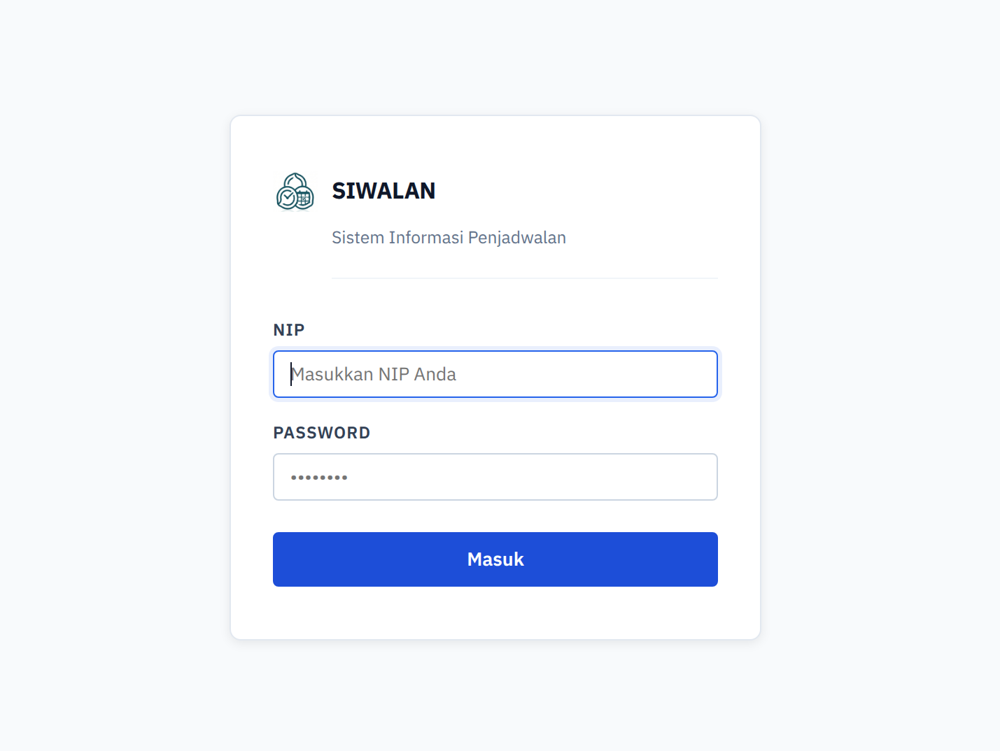
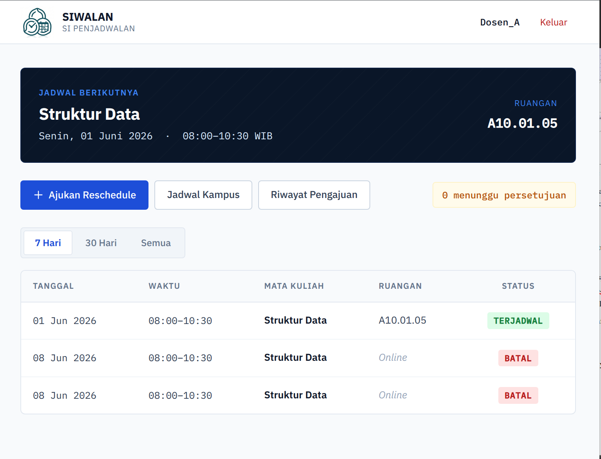
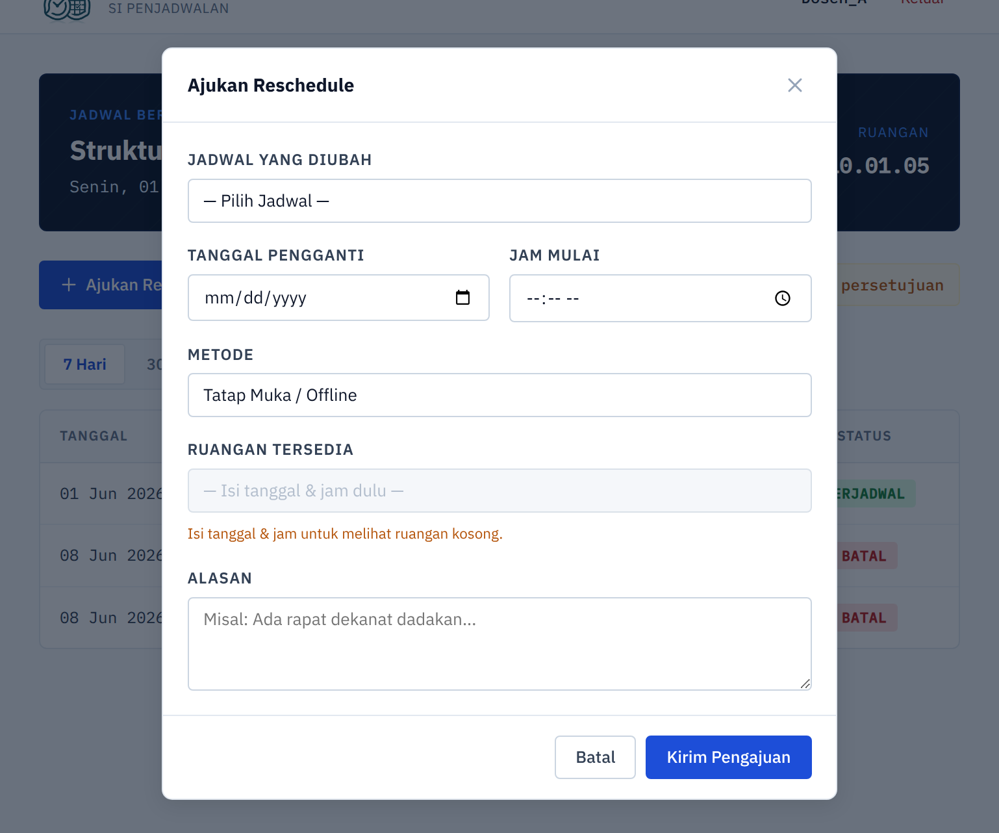
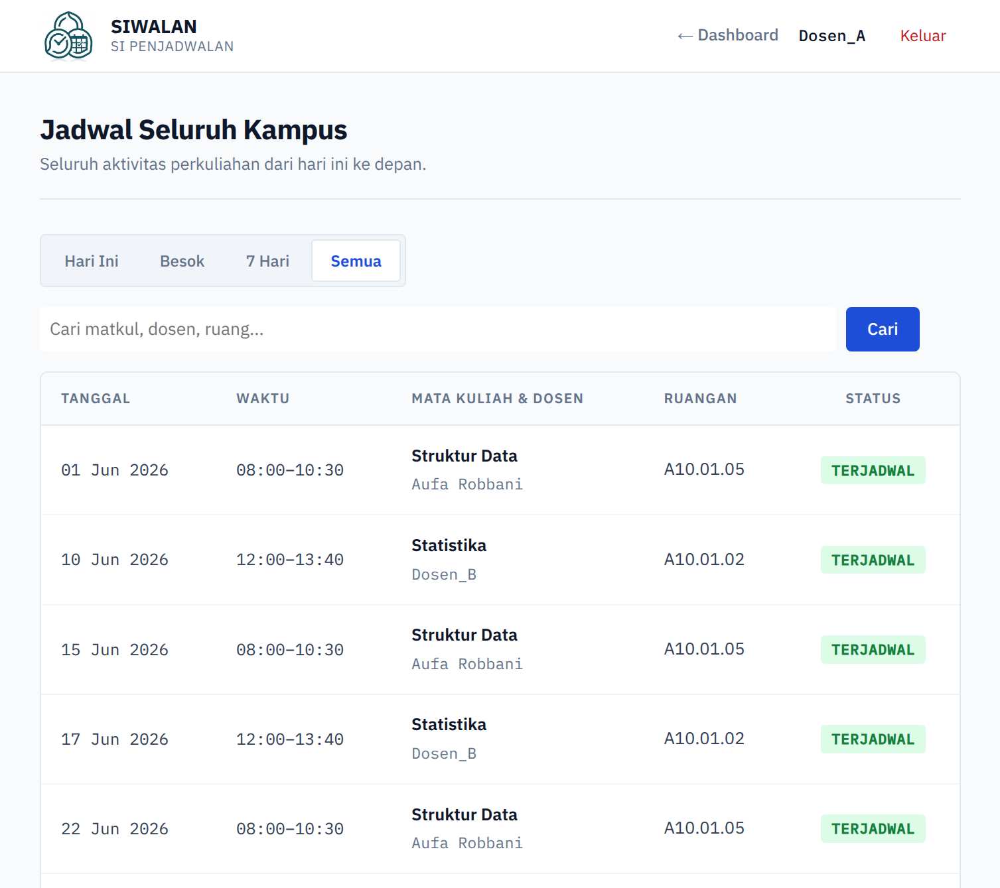
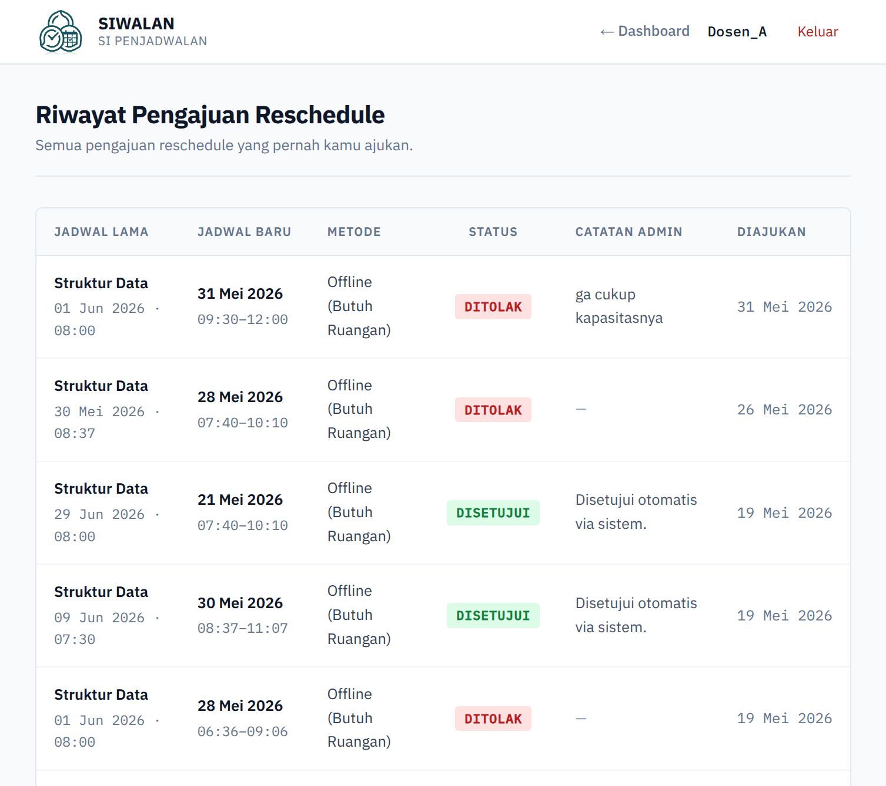

# SIWALAN (Sistem Informasi Penjadwalan)

## 📌 Deskripsi Project

Proyek ini adalah sebuah Sistem Informasi berbasis web yang dikembangkan menggunakan framework **Django (Python)**. Sistem ini dirancang untuk menyelesaikan permasalahan penjadwalan kelas manual (_Constraint Satisfaction Problem_) dengan menyediakan fitur pembuatan jadwal otomatis dan mesin validasi anti-bentrok.

Aplikasi ini mempermudah admin dalam mengelola jadwal satu semester dan memungkinkan dosen untuk mengajukan pemindahan jadwal (_reschedule_) secara mandiri dengan mencari ruang kosong secara _real-time_.

---

## 👥 Anggota Kelompok 9

| Nama                       | NIM         |
| -------------------------- | ----------- |
| Ahmad Jouwdad Aufa Robbani | 25051204163 |

---

## ✨ Fitur Utama

### 📅 Generator Jadwal Semester Otomatis

Mencetak jadwal perkuliahan selama 16 minggu dari satu jadwal dasar dan secara otomatis membatalkan kelas yang jatuh pada hari libur nasional.

### 🚫 Mesin Validasi Anti-Bentrok

Melakukan validasi multi-layer untuk mencegah:

- Bentrok ruangan
- Bentrok dosen
- Bentrok jadwal mahasiswa
- Jadwal pada hari libur nasional

### 🏫 Pencari Ruang Kosong Cerdas

Menampilkan daftar ruangan yang:

- Tidak sedang digunakan
- Memiliki kapasitas yang cukup untuk jumlah mahasiswa

### 👨‍🏫 Dashboard & Filter Dosen

Menyediakan antarmuka khusus dosen untuk melihat jadwal:

- Harian
- Mingguan
- Bulanan

### 🔐 Autentikasi Custom

Sistem login menggunakan **Nomor Induk Pegawai (NIP)** sebagai identitas pengguna.

---

## 🚀 Cara Menjalankan Project

### 1. Persiapan

Pastikan telah menginstal:

- Python 3.8 atau lebih baru
- Git

---

### 2. Clone Repository

```bash
git clone https://github.com/auparr/SIWALAN
cd SIWALAN
```

---

### 3. Buat dan Aktivasi Virtual Environment

#### Windows

```bash
python -m venv env
env\Scripts\activate
```

#### Linux / Ubuntu

```bash
python3 -m venv env
source env/bin/activate
```

---

### 4. Instalasi Dependensi

```bash
pip install -r requirements.txt
```

---

### 5. Migrasi Database

```bash
python manage.py makemigrations
python manage.py migrate
```

---

### 6. Membuat Akun Administrator

```bash
python manage.py createsuperuser
```

Ikuti instruksi yang muncul pada terminal untuk membuat akun admin.

---

### 7. Menjalankan Server

```bash
python manage.py runserver
```

Buka browser dan akses:

```text
http://127.0.0.1:8000/
```

---

## 🧬 Implementasi Object-Oriented Programming (OOP)

Proyek ini menerapkan empat pilar utama OOP melalui pemodelan database menggunakan Django ORM.

### 1. Class & Object

Setiap entitas sistem diwujudkan sebagai kelas (_class_) yang menghasilkan objek (_object_) nyata dalam database, seperti:

- `Ruangan`
- `MataKuliah`
- `ActualSession`
- `PengajuanReschedule`

---

### 2. Inheritance (Pewarisan)

Seluruh model mewarisi kelas dasar Django:

```python
models.Model
```

Selain itu terdapat kelas abstrak:

```python
SesiWaktuBase
```

yang digunakan sebagai induk bagi kelas-kelas jadwal sehingga mengurangi duplikasi kode.

---

### 3. Polymorphism (Polimorfisme)

Setiap model melakukan _method overriding_ terhadap fungsi:

```python
__str__()
```

untuk menghasilkan representasi teks yang berbeda sesuai karakteristik masing-masing objek.

Contoh:

```python
Ruang A101 (Kapasitas: 40)
```

---

### 4. Encapsulation & Abstraction

Logika perhitungan waktu perkuliahan disembunyikan di dalam kelas abstrak melalui fungsi seperti:

```python
_hitung_jam_selesai(sks, jam_awal)
```

Kelas lain cukup memanggil fungsi tersebut tanpa perlu mengetahui detail proses perhitungan jam dan menit yang terjadi di belakang layar.

---

## 📸 Screenshot Tampilan Program

### 1. Halaman Login



---

### 2. Dashboard Dosen



---

### 3. Form Reschedule & Cari Ruang Kosong



---

### 4. Jadwal Publik Kampus



---

### 5. Jadwal Publik Kampus



---

## 🛠️ Teknologi yang Digunakan

- Python
- Django
- SQLite
- HTML
- CSS
- JavaScript

---

## 📄 Lisensi

Proyek ini dibuat untuk memenuhi tugas mata kuliah dan tujuan pembelajaran akademik.
